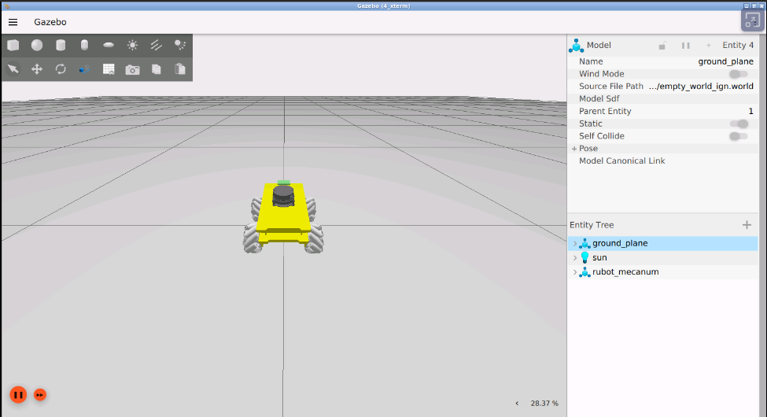
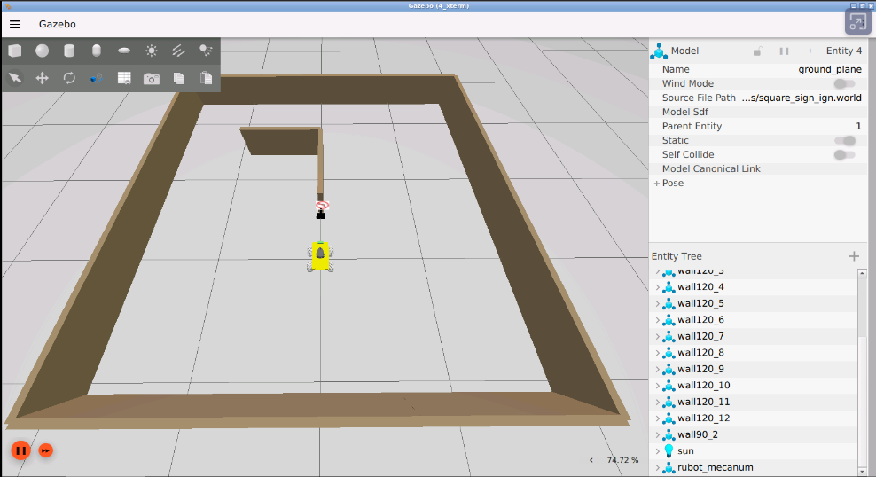
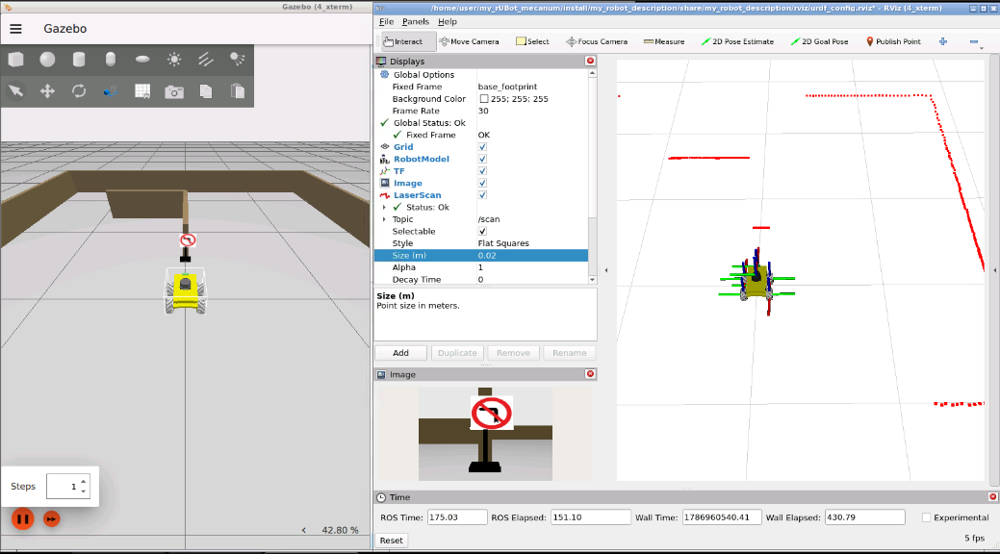
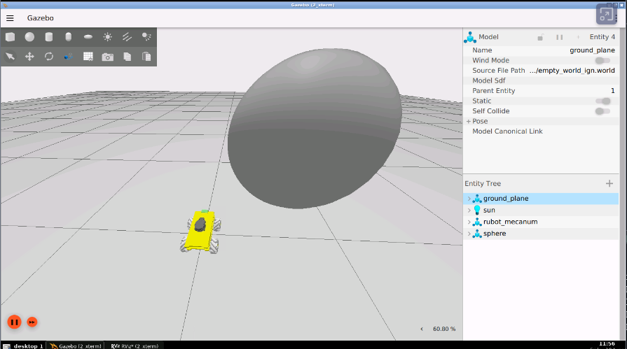
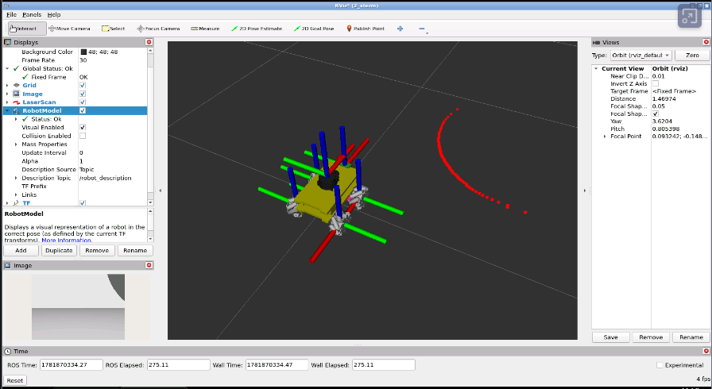
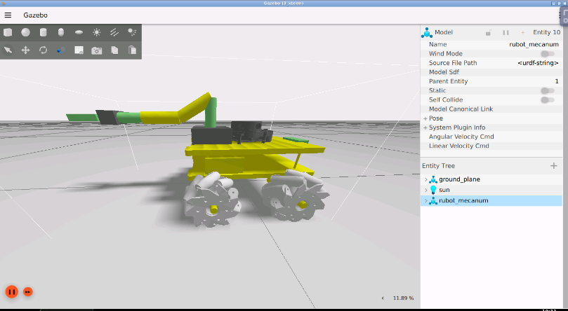
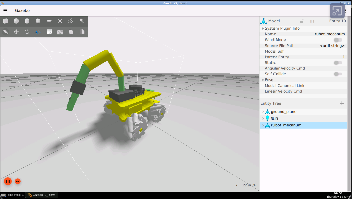

## **2. ROS2 my robot model and Bringup**
The main objective of this section is to review the robot bringup process in virtual environment and within the real robots.

The particular objectives of this section are:
- Create a complete robot model of our robots
- Review the main tools:
  - rviz to visualization of robot geometry and messages published in topics
  - Gazebo as a physical simulator containing the main drivers for robot functionalities (sensors and actuators)
- Create a world model of the virtual environment
- Bringup the robot in virtual environment
- Bringup the real robot.

> **Simulation platform**
>
> This project uses **Gazebo Sim Fortress (formerly Ignition Gazebo,
> Gazebo 6)** with ROS 2 Humble.
>
> The integration uses:
>
> * `ros_gz_sim` to launch Gazebo Sim and spawn the robot.
> * `ros_gz_bridge` to exchange messages between Gazebo Transport and ROS 2.
> * `ign_ros2_control` to control the robotic arm.
>
> Gazebo Classic, `gazebo_ros`, `spawn_entity.py` and
> `GAZEBO_MODEL_PATH` are not used by the current Gazebo Sim launch files.

The robots we will work are:
- Differential-Drive robot: movement like turtlesim
- Mecanum-Drive robot: more performand movements in x and y directions

These are represented in the picture below:


A very good guide is described in: 
- [Udemy course ROS2 Robot Models by Edouard Renard](https://www.udemy.com/course/ros2-tf-urdf-rviz-gazebo/learn/lecture/38688920#overview)

### **2.1. Create a robot model of our rUBot mecanum**

Different robot models have been created to be used in ROS2 Virtual environment:
- 2-wheel Differential Drive robot-based model
- 4-wheel Mecanum Drive robot-based model

These kind of robot models can be equipped with a robotic arm:


With 3D custom designed parts (rUBot and Limo robots):


The file format for a robotic model is:
- **URDF** (Unified Robot Description Format): XML-based format to describe the physical configuration of a robot, including its links, joints, and sensors.
- **XACRO** (XML Macros): XML-based, but with macro capabilities for generating URDF files. This format will help you to better organize and scale your model with more functionalities.

For this purpose we have already created:
- a "my_robot_description" package with the instruction:
  ````shell
  ros2 pkg create --build-type ament_cmake --license Apache-2.0 my_robot_description --dependencies rclcpp
  ````
- New folders inside: launch, meshes, rviz, urdf. For that we have to add these lines on CMakeLists.txt:
  ````shell
  install(
  DIRECTORY meshes urdf launch rviz
  DESTINATION share/${PROJECT_NAME}/
  )
  ````

#### **rUBot Mecanum Model design**

The geometrical definition of our rUBot is graphically described by:


The different elements (named **links**) are:
- base_link
- wheels
- camera
- base_scan

These elements are connected each-other by **joints**:
- base_link_joint
- wheel_joint
- joint_camera
- scan_joint


Some of these links have a speciffic **functionalities**:
- wheels: perform a robot movement according to a Mecanum-drive kinematics
- camera: view front images
- base_scan: detect obstacle distances in 360º around the robot

To create our robot model, we use **URDF files** (Unified Robot Description Format). URDF file is an XML format file for representing a robot model. [URDF official Tutorials](http://wiki.ros.org/urdf/Tutorials)

The general structure of a robot urdf model is based on:
- Links and joints: for the geometrical structure
- Gazebo Sim systems and sensors: to simulate actuators, odometry and sensor data

The urdf file structure is:
```xml
<?xml version="1.0" encoding="utf-8"?>
<robot name="rubot">
  <link name="base_link">
  ...
  </link>
  <joint name="base_link_joint" type="fixed">
  ...
  </joint>
  <gazebo>
    <plugin>
    ...
    </plugin>
  </gazebo>
  <gazebo reference="upper_left_wheel">
  ...
  </gazebo>
</robot>
```

We have created 2 folders for model description:
- URDF: folder where different URDF models are located. In our case rubot.urdf
- meshes: folder where 3D body models in stl format are located. We will have rubot folder.

As we have explained above, main parts of URDF model are:
- links: diferent bodies/plastic elements
- joints: connection between 2 links 
- sensors & actuators plugins (2D camera, LIDAR and 4-wheels mecanum-drive)

The **link definition** contains:
- visual properties: the origin, geometry and material
- collision properties: the origin and geomnetry
- inertial properties: the origin, mass and inertia matrix

The **joint definition** contains:
- joint Type (fixed, continuous)
- parent and child frames
- origin frame
- rotation axis

In the case or upper left wheel link:
```xml
<!-- upper_left_wheel -->
  <joint name="upper_left_wheel_joint" type="continuous">
    <origin rpy="0 0 0" xyz="0.07 0.1 0"/>
    <parent link="base_link"/>
    <child link="upper_left_wheel"/>
    <axis xyz="0 1 0"/>
  </joint>
  <link name="upper_left_wheel">
    <visual>
      <origin rpy="0 0 0" xyz="0 0 0"/>
      <geometry>
        <mesh filename="file://$(find my_robot_description)/meshes/upper_left_wheel.stl" scale="0.001 0.001 0.001"/>
        <!-- <cylinder length="0.03" radius="0.05"/>-->
      </geometry>
      <material name="light_grey"/>
    </visual>
    <collision>
      <origin rpy="-1.57 0 0" xyz="0 0 0"/>
      <geometry>
        <cylinder length="0.03" radius="0.055"/>
      </geometry>
    </collision>
    <inertial>
      <mass value="0.2"/>
      <inertia ixx="0.000166" ixy="0" ixz="0" iyy="0.000303" iyz="0" izz="0.000166"/>
    </inertial>
  </link>
```
The rUBot model includes different **sensors and actuators**:

The full model contains also information about the sensor and actuator controllers using specific **Gazebo plugins**

The complete robot model also defines the Gazebo Sim systems and
sensors required to simulate motion, odometry, LiDAR and camera data.

Gazebo Sim produces messages through Gazebo Transport. The
`ros_gz_bridge` node converts the selected Gazebo messages into
ROS 2 messages.

These plugins can be referenced through a URDF file, and to insert them in the URDF file, you have to follow the sintax:

**2D-camera Sensor**:

The two-dimensional camera sensor corresponds to the USB real camera. 

This camera obtains 2D images in the front and is simulated in URDF model as:
- link with the visual, collision and inertial properties
- joint of fixed type
- Gazebo plugin as a sort of "driver" to simulate the real behaviour

Review the joint, link and Gazebo plugin definition in URDF model.

You can allways call the image typing in a new terminal:
>```shell
>rqt image view
>```

**RPlidar sensor**

A Lidar sensors is  device that is able to measure the obstacle distances at 360º around the robot. 

He is sending 720 laser beams (2 beams/degree) and measures the distance each laser beam finds an obstacle. He is able to measure from 12cm to 10m. The used Lidar sensor is a 360º RPLidar A1M8. Review the official documentation:
- [RPLidar in RoboShop](https://www.robotshop.com/es/es/rplidar-a1m8-kit-desarrollo-escaner-laser-360-grados.html)
- [Slamtec Support RPLidar A series](https://www.slamtec.com/en/Support#rplidar-a-series)

This lidar is simulated in URDF model as:
- link with the visual, collision and inertial properties
- joint of fixed type
- Gazebo plugin as a sort of "driver" to simulate the real behaviour

 Review the joint and link definition in URDF model.
> Note that rpLIDAR is mounted at 180º and you need to turn the link model and the joint to reflect this in the URDF model.


The gazebo plugin we have used is:
```xml
<gazebo reference="base_scan">
    <sensor name="lidar" type="gpu_lidar">
        <pose>0 0 0 0 0 0</pose>
        <topic>/scan</topic>
        <update_rate>10</update_rate>
        <ray>
        <scan>
            <horizontal>
            <samples>360</samples>
            <resolution>1</resolution>
            <min_angle>-2.3</min_angle>
            <max_angle>2.3</max_angle>
            </horizontal>
        </scan>
        <range>
            <min>0.12</min>
            <max>10.0</max>
            <resolution>0.01</resolution>
        </range>
        </ray>
        <always_on>true</always_on>
        <visualize>false</visualize>
    </sensor>
</gazebo>

```
We have to consider 2 kind of robots:
- **rUBot**: its Lidar has scan range from -180º to +180º with 2 laser beam/degree
  ````xml
  <scan>
    <horizontal>
      <samples>720</samples>
      <resolution>1.00000</resolution>
      <min_angle>-3.14</min_angle>
      <max_angle>3.14</max_angle>
    </horizontal>
  </scan>
  ````
- **Limo**: its Lidar has scan range from -110º to +110º with 1 laser beam/degree
  ````xml
  <scan>
    <horizontal>
      <samples>220</samples>
      <resolution>1.00000</resolution>
      <min_angle>-1.92</min_angle>
      <max_angle>1.92</max_angle>
    </horizontal>
  </scan>
  ````

It is important to note that:
- the number of points of real RPLidar depends on Lidar model (you will need tot test it first)
- the number of points of simulated Lidar is selected to 720

**Actuator**:

The rUBot_mecanum contains a "Mecanum drive actuator" based on:
- 4 wheels driven by a DC servomotor 
- with speciffic Kinematic control 
- able to move the robot in x and y directions
- and able to obtain the Odometry information

The current Gazebo Sim model uses two Gazebo Sim systems:

* `VelocityControl` receives the desired robot velocity through
  `/cmd_vel`.
* `OdometryPublisher` publishes the simulated pose and velocity
  through `/odom` and `/tf`.

The launch file bridges `/cmd_vel` from ROS 2 to Gazebo Sim and bridges `/odom` and `/tf` from Gazebo Sim to ROS 2.

The **rUBot_mecanum kinematics** describes the relationship between the robot wheel speeds and the robot velocity. We have to distinguish:
* **Inverse kinematics:** converts the desired platform velocity
  `(vx, vy, wz)` into wheel velocities.
* **Forward kinematics:** estimates platform velocity from wheel
  velocities.
* **Odometry:** integrates platform motion to estimate its pose
  relative to the `odom` frame.

This driver is described in URDF model as:
```xml
<gazebo>
<!-- Holonomic / planar velocity control -->
<plugin filename="libignition-gazebo6-velocity-control-system.so"
        name="ignition::gazebo::systems::VelocityControl">
    <topic>/cmd_vel</topic>
</plugin>

<!-- Odometry publisher -->
<plugin filename="libignition-gazebo6-odometry-publisher-system.so"
        name="ignition::gazebo::systems::OdometryPublisher">
    <odom_frame>odom</odom_frame>
    <robot_base_frame>base_link</robot_base_frame>
    <odom_topic>/odom</odom_topic>
    <tf_topic>/tf</tf_topic>
    <odom_publish_frequency>50</odom_publish_frequency>
</plugin>
</gazebo>
```

#### **RVIZ ROS visualization Tool**

We will first use RVIZ to check that the model is properly built. 

RViz only represents the robot visual features. You have available all the options to check every aspect of the appearance of the model.

We have created a `display.launch.py` launch file with arguments:
- `robot_model`: the robot model to be displayed in RViz. The default value is "rubot/rubot_mecanum.urdf"
- `use_sim_time`: if True, the Gazebo simulation time is used, but if you have not opened Gazebo you will find an error. if False, real raspberrypi time is used when we want to work with the real robot. The default value is False

If you want to use the default argument values, type in a new terminal:
```shell
ros2 launch my_robot_description display.launch.py robot_model:=rubot/rubot_mecanum.urdf.xacro
```


If you want to see other robot models, use speciffic `robot_model` argument, type in a new terminal:
```shell
ros2 launch my_robot_description display.launch.py robot_model:=rubot_arm/rubot_mecanum_arm.urdf.xacro
```
> Colors in rviz: 
>- are defined at the beginning
>- Ensure the "visual" link properties have color "name"
```xml
<robot name="rubot">
  <material name="yellow">
    <color rgba="0.8 0.8 0.0 1.0"/>
  </material>

  ...

    <link name="base_link">
    <visual>
      <origin rpy="0 0 0" xyz="0 0 0"/>
      <geometry>
        <mesh filename="file://$(find my_robot_description)/meshes/rubot/base_link.stl" scale="0.001 0.001 0.001"/>
      </geometry>
      <material name="yellow"/>
    </visual>
```

### **2.2. Bringup the rUBot in virtual world environment**

Before testing algorithms on the real robot, we simulate the robot in a virtual environment. This allows us to verify the robot model, sensors, motion and ROS 2 communication without using the physical platform.

This project uses **Gazebo Sim Fortress**, formerly known as Ignition Gazebo. It does not use Gazebo Classic.

The integration between ROS 2 and Gazebo Sim is provided by:

- `ros_gz_sim`: launches Gazebo Sim and creates the robot entity.
- `ros_gz_bridge`: exchanges messages between Gazebo Transport and ROS 2.
- `robot_state_publisher`: publishes the robot kinematic tree.
- `tf2_ros`: publishes the additional static transforms required by the simulated sensors.

The simulation package is:

```text
my_robot_bringup
```

Its relevant folders are:

```text
my_robot_bringup/
├── config/
├── launch/
├── models/
├── rviz/
└── worlds/
```

These folders are installed through `CMakeLists.txt`:

```cmake
install(
  DIRECTORY launch models rviz worlds config
  DESTINATION share/${PROJECT_NAME}/
)
```

#### **Gazebo Sim bringup launch file**

The launch file used for the rUBot mecanum simulation is:

```text
my_robot_bringup_gz.launch.py
```

This launch file performs the following operations:

1. Generates the robot description from the selected Xacro file.
2. Starts `robot_state_publisher`.
3. Starts Gazebo Sim with the selected world.
4. Creates the robot entity using `ros_gz_sim create`.
5. Starts the ROS–Gazebo bridge.
6. Publishes the static transforms required by the LiDAR and camera frames.

The available launch arguments are:

| Argument | Description | Default value |
| --- | --- | --- |
| `world` | World file inside `my_robot_bringup/worlds` | `empty_world_ign.world` |
| `robot_model` | Xacro model relative to `my_robot_description/urdf` | `rubot/rubot_mecanum.urdf.xacro` |
| `robot_name` | Name of the entity created in Gazebo Sim | `rubot_mecanum` |
| `x` | Initial x position in metres | `0.0` |
| `y` | Initial y position in metres | `0.0` |
| `z` | Initial z position in metres | `0.08` |
| `yaw` | Initial orientation in radians | `0.0` |

To launch the default robot and world:

```bash
ros2 launch my_robot_bringup my_robot_bringup_gz.launch.py
```

To select a world and an initial robot pose:

```bash
ros2 launch my_robot_bringup my_robot_bringup_gz.launch.py \
  world:=square_sign_ign.world \
  robot_model:=rubot/rubot_mecanum.urdf.xacro \
  robot_name:=rubot_mecanum \
  x:=0.0 \
  y:=0.0 \
  z:=0.08 \
  yaw:=0.0
```

> The `yaw` argument is expressed in radians. For example, `1.5708` corresponds approximately to 90 degrees.




#### **ROS 2 and Gazebo Sim communication**

Gazebo Sim uses Gazebo Transport internally. Therefore, simulated messages are not automatically available as ROS 2 topics.

The `ros_gz_bridge` node converts the selected messages between Gazebo Transport and ROS 2.

The current launch file bridges the following topics:

| Topic | Direction | ROS 2 message |
| --- | --- | --- |
| `/clock` | Gazebo Sim → ROS 2 | `rosgraph_msgs/msg/Clock` |
| `/cmd_vel` | ROS 2 → Gazebo Sim | `geometry_msgs/msg/Twist` |
| `/odom` | Gazebo Sim → ROS 2 | `nav_msgs/msg/Odometry` |
| `/scan` | Gazebo Sim → ROS 2 | `sensor_msgs/msg/LaserScan` |
| `/tf` | Gazebo Sim → ROS 2 | `tf2_msgs/msg/TFMessage` |
| `/camera/image` | Gazebo Sim → ROS 2 | `sensor_msgs/msg/Image` |

#### **Verify the simulation**

List the running ROS 2 nodes:

```bash
ros2 node list
```

List the available ROS 2 topics:

```bash
ros2 topic list
```

Verify that the simulation clock is available:

```bash
ros2 topic echo /clock --once
```

Verify the LiDAR data:

```bash
ros2 topic hz /scan
```

Verify the camera images:

```bash
ros2 topic hz /camera/image
```

Verify the odometry:

```bash
ros2 topic echo /odom --once
```

#### **Visualize the simulated robot in RViz**

The Gazebo Sim bringup launch file does not start RViz automatically.

Keep the Gazebo Sim launch running and open a second terminal. Start RViz with the same robot model and the simulation clock:

```bash
ros2 launch my_robot_description display.launch.py \
  use_sim_time:=true \
  robot_model:=rubot/rubot_mecanum.urdf.xacro
```

In RViz, add the appropriate displays:

- `RobotModel` to visualize the robot.
- `TF` to inspect the coordinate frames.
- `LaserScan` with topic `/scan`.
- `Image` with topic `/camera/image`.
- `Odometry` with topic `/odom`.



#### **Design a custom Gazebo Sim world**

During the following laboratory sessions, the robot will perform control, mapping and autonomous navigation tasks inside a simulated environment.

Each group must create a custom Gazebo Sim world that will be reused during these sessions.

Gazebo Sim worlds are described using **SDF**. In this project, world files use the `.world` extension and are stored in:

```text
src/my_robot_bringup/worlds/
```

Reusable Gazebo Sim models are stored in:

```text
src/my_robot_bringup/models/
```

The project already provides the following wall models:

```text
wall30cm
wall60cm
wall90cm
wall120cm
```

Each reusable model contains:

```text
model_name/
├── model.config
└── model.sdf
```

The `model.config` file describes the model and points to its SDF file. The `model.sdf` file defines its geometry, collision properties, visual properties and material.

#### **Start from the world template**

Use the following file as the starting template:

```text
src/my_robot_bringup/worlds/empty_world_ign.world
```

Do not modify the original template. Create a copy for your group:

```bash
cd ~/my_rUBot_mecanum/src/my_robot_bringup/worlds
cp empty_world_ign.world group1_custom.world
```

Replace `group1` with the identifier assigned to your group.

Change the world name inside the copied file:

```xml
<world name="group1_custom">
```

The template already contains:

- The ODE physics configuration.
- The Gazebo Sim physics system.
- The user-command system.
- The scene broadcaster.
- The sensor system.
- Scene and illumination configuration.
- A ground plane.

Keep these elements in the custom world because they are required for the robot, sensors and simulation to work correctly.

#### **Add reusable models to the world**

Models are added inside the `<world>` element using `<include>`:

```xml
<include>
  <uri>model://wall120cm</uri>
  <name>wall120_1</name>
  <pose>1.0 0.0 0.15 0 0 0</pose>
</include>
```

The model URI identifies a directory inside:

```text
src/my_robot_bringup/models/
```

For example:

```xml
<uri>model://wall30cm</uri>
<uri>model://wall60cm</uri>
<uri>model://wall90cm</uri>
<uri>model://wall120cm</uri>
```

Every model instance must have a unique name:

```xml
<name>wall120_1</name>
<name>wall120_2</name>
<name>wall90_1</name>
```

Do not reuse the same instance name more than once in the same world.

#### **Model pose**

The model pose has six values:

```text
x y z roll pitch yaw
```

For example:

```xml
<pose>1.0 0.5 0.15 0 0 1.5708</pose>
```

This places the model at:

```text
x = 1.0 m
y = 0.5 m
z = 0.15 m
yaw = 1.5708 rad
```

A yaw value of `1.5708` radians corresponds approximately to 90 degrees.

The existing wall models are 0.30 m high and their geometry is centred on their local origin. Therefore, they are normally placed at:

```text
z = 0.15
```

This makes the bottom of the wall coincide with the ground plane.

Examples of wall orientation:

Horizontal wall:

```xml
<include>
  <uri>model://wall120cm</uri>
  <name>horizontal_wall_1</name>
  <pose>0 1.0 0.15 0 0 0</pose>
</include>
```

Vertical wall:

```xml
<include>
  <uri>model://wall120cm</uri>
  <name>vertical_wall_1</name>
  <pose>1.0 0 0.15 0 0 1.5708</pose>
</include>
```

Use `square_sign_ign.world` as a complete reference showing how several reusable models can be included and positioned.

#### **Activity: create the group laboratory world**

Create a custom world that can be used in the following control, SLAM and navigation sessions.

Do not place a wall or obstacle at the robot's initial position.

The complete environment should remain reasonably close to the origin. A recommended working area is approximately:

```text
-3 m <= x <= 3 m
-3 m <= y <= 3 m
```

#### **Build and launch the custom world**

After creating or modifying a world, rebuild the bringup package:

```bash
cd ~/my_rUBot_mecanum
colcon build
source install/setup.bash
```

Launch the robot inside the custom world:

```bash
ros2 launch my_robot_bringup my_robot_bringup_gz.launch.py \
  world:=group1_custom.world \
  robot_model:=rubot/rubot_mecanum.urdf.xacro \
  x:=0.0 \
  y:=0.0 \
  z:=0.08 \
  yaw:=0.0
```

Replace `group1_custom.world` with the name of your world file.

Visualize the LiDAR measurements in RViz:

```bash
ros2 launch my_robot_description display.launch.py \
  use_sim_time:=true \
  robot_model:=rubot/rubot_mecanum.urdf.xacro
```

#### **Deliverables**

Each group must submit:

1. The custom world file:

   ```text
   groupN_custom.world
   ```

2. A top-view screenshot of the complete world.

3. A screenshot showing the robot and LiDAR measurements in RViz.

The same world will be reused in the following robot control, SLAM and autonomous navigation activities.

### **2.3. First driving Control**

The objective here is only to verify that the robot is correcly bringup and we can control it using the "teleop-twist-keyboard" package.

- Install the "teleop-twist-keyboard" package. (usually is already installed)
```shell
sudo apt update
sudo apt install ros-humble-teleop-twist-keyboard
```

#### **Virtual environment**

When you are using the virtual environment to simulate the robot behavior you have to:
- Bringup our robot in Gazebo virtual environment
  ````shell
  ros2 launch my_robot_bringup my_robot_bringup_gz.launch.xml
  ````
  > The argument `use_sim_time` is by default true in this launch file

  
  

- In a new terminal, launch the teleop-twist-keyboard:
  ```shell
  ros2 run teleop_twist_keyboard teleop_twist_keyboard
  ```
- open a new terminal and listen the /odom topic
  ```shell
  ros2 topic echo /odom
  ```
- Print the Nodes and topics using rqt_graph

  

#### **Real robot**

When you are using the real robot, the bringup is already done. You need only to view the topics with:
```shell
ros2 launch my_robot_description display.launch.py use_sim_time:=false
````
> In real robot, we use `use_sim_time:=false` 

Launch the teleop-twist-keyboard control node:
```shell
ros2 run teleop_twist_keyboard teleop_twist_keyboard
```

## Bringup the rUBot with a mecanum arm

### In virtual environment
- Bringup the robot:
````bash
ros2 launch my_robot_bringup my_robot_arm_bringup_gz.launch.py  robot_model:=rubot_arm/rubot_mecanum_arm.urdf.xacro
````
- Launch the teleop-twist-keyboard control node to control the robot movement:
```shell
ros2 run teleop_twist_keyboard teleop_twist_keyboard
```
- To control Joint angles:
````bash
ros2 topic pub /arm_controller/joint_trajectory trajectory_msgs/msg/JointTrajectory "
joint_names:
- arm_joint1
- arm_joint2
- arm_joint3
- arm_joint4
- arm_joint5
- arm_joint6
points:
- positions: [0.0, -1.0, 2.0, 0.0, 0.0, 0.000]
  time_from_start: {sec: 1, nanosec: 0}
" --once
````



- To terform a trajectory sequence:
````bash
- control Joints:
````bash
ros2 topic pub /arm_controller/joint_trajectory trajectory_msgs/msg/JointTrajectory "
joint_names:
- arm_joint1
- arm_joint2
- arm_joint3
- arm_joint4
- arm_joint5
- arm_joint6
points:
- positions: [0.0, -1.0, 1.0, 0.0, 0.0, 0.000]
  time_from_start: {sec: 1, nanosec: 0}
- positions: [0.5, -1.0, 2.0, 0.0, 0.0, 0.000]
  time_from_start: {sec: 3, nanosec: 0}
- positions: [0.5, -1.0, 2.0, 0.8, 0.0, 0.005]
  time_from_start: {sec: 5, nanosec: 0}
" --once
````


### **Real robot**

When using the real robot, the bringup is already made on poweron as a service, but if you want to launch manually you will have to type:

````bash
ros2 launch my_robot_bringup my_robot_arm_bringup_hw.launch.py 
````

You can test the robot movement and the joint angles with the same instructions as in virtual environment