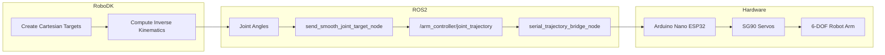
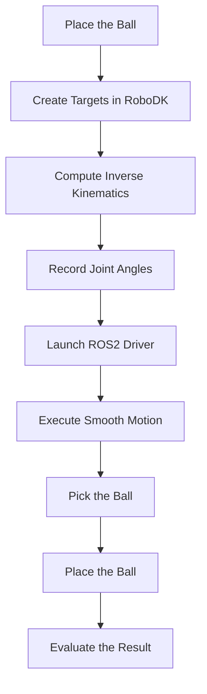
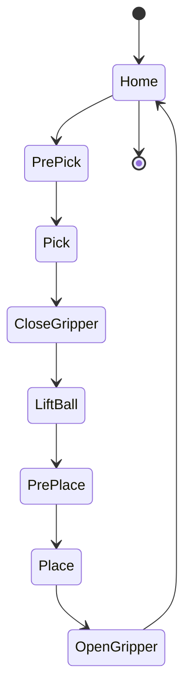
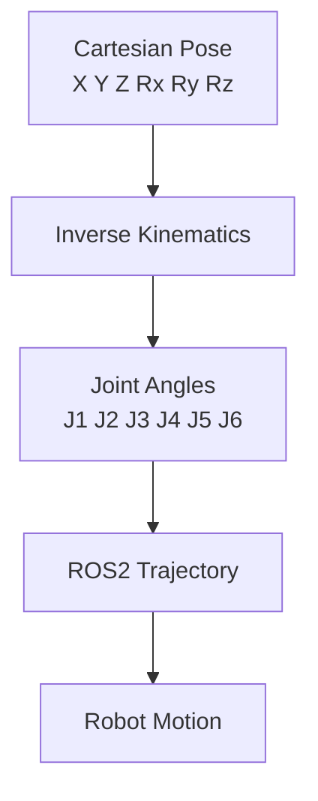
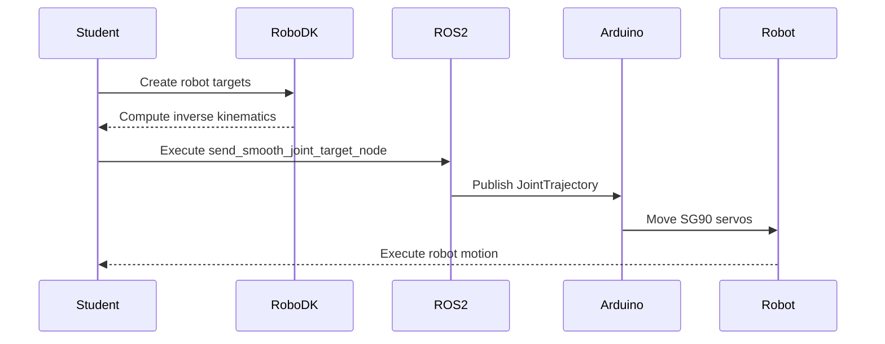
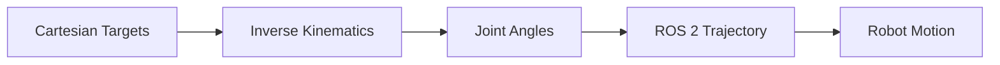
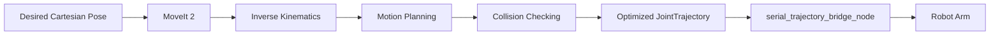

# 04 - Pick and Place a Ball Using Inverse Kinematics

## Objectives

In this laboratory you will perform your first complete robot manipulation task using the 6-DOF robot arm.

After completing this exercise, you should be able to:

* Understand the role of **Inverse Kinematics (IK)** in robot manipulation.
* Create Cartesian targets using **RoboDK**.
* Compute the corresponding joint angles.
* Execute smooth robot motions using the ROS 2 arm driver.
* Pick up a ball and place it at another location.

---

# 1. Introduction

In the previous laboratory, the robot arm was controlled by directly specifying the joint angles.

Although this approach is useful for testing the robot, industrial robots are rarely programmed this way. Instead, tasks are usually defined by specifying the desired **position and orientation of the end-effector**.

For example:

> *Move the gripper above the ball.*

This instruction defines a **Cartesian pose**, not a set of joint angles.

To reach that pose, the robot must solve the **Inverse Kinematics (IK)** problem.

In this laboratory, the inverse kinematics calculations will be performed using **RoboDK**, where the robot model has already been created.

Once the joint angles have been obtained, they will be executed using the ROS 2 driver developed in the previous laboratory.

---

# 2. Software Architecture

The complete workflow is illustrated below.



The workflow consists of four main stages:

1. Create the desired robot poses in RoboDK.
2. Compute the corresponding inverse kinematics.
3. Send the resulting joint angles to ROS 2.
4. Execute the motion on the physical robot.

---

# 3. Laboratory Setup

Place a lightweight ball inside the robot workspace.

A possible setup is shown below.

```text
                     Top View

                 Robot Base
                     O

         Ball A                  Ball B

     Pick Position          Place Position
```

The ball should be positioned close to the robot base (approximately **12–18 cm**) so that all targets remain inside the robot workspace.

---

# 4. Robot Targets

Create the following targets in RoboDK:

* Home
* PrePick
* Pick
* PrePlace
* Place

The **PrePick** and **PrePlace** targets should be located approximately **5 cm above** the ball.

This prevents collisions with the table and allows smoother robot motions.

Example:

```text
                 Side View

               PrePick
                  ●
                  │
               5 cm
                  │
                  ● Pick
                 (Ball)

──────────────────────────────────── Table
```

---

# 5. Laboratory Workflow

The complete manipulation task is illustrated below.



---

# 6. Pick-and-Place Sequence

The robot should execute the following sequence.



The robot should:

1. Move from the **Home** position.
2. Approach the ball (**PrePick**).
3. Reach the **Pick** position.
4. Close the gripper.
5. Lift the ball.
6. Move above the destination (**PrePlace**).
7. Reach the **Place** position.
8. Open the gripper.
9. Return to the **Home** position.

---

# 7. Computing the Inverse Kinematics

For each target created in RoboDK:

1. Move the robot until the gripper reaches the desired pose.
2. Save the target.
3. Read the joint values computed by RoboDK.
4. Record the joint angles in the following table.

## Cartesian Targets

| Target   | X (mm) | Y (mm) | Z (mm) | Rx (°) | Ry (°) | Rz (°) |
| -------- | -----: | -----: | -----: | -----: | -----: | -----: |
| Home     |        |        |        |        |        |        |
| PrePick  |        |        |        |        |        |        |
| Pick     |        |        |        |        |        |        |
| PrePlace |        |        |        |        |        |        |
| Place    |        |        |        |        |        |        |

---

## Joint Angles Obtained from RoboDK

| Target   | J1 (°) | J2 (°) | J3 (°) | J4 (°) | J5 (°) | J6 (°) |
| -------- | -----: | -----: | -----: | -----: | -----: | -----: |
| Home     |        |        |        |        |        |        |
| PrePick  |        |        |        |        |        |        |
| Pick     |        |        |        |        |        |        |
| PrePlace |        |        |        |        |        |        |
| Place    |        |        |        |        |        |        |

The relationship between both tables is summarized below.



This is the key concept of the laboratory:

* **The task is defined in Cartesian space.**
* **Inverse Kinematics computes the corresponding joint configuration.**
* **ROS 2 executes the resulting trajectory on the robot.**

---

# 8. Executing the Pick-and-Place Task

After computing the joint angles in RoboDK, the next step is to execute the corresponding robot motions using the ROS 2 arm driver.

The complete workflow is illustrated below.



---

## Step 1 – Launch the Driver

Open a terminal and launch the serial driver.

```bash
ros2 run my_arm_driver serial_trajectory_bridge_node
```

Verify that the node is running:

```bash
ros2 node list
```

You should see:

```text
/serial_trajectory_bridge_node
```

---

## Step 2 – Execute the Robot Targets

For each target obtained from RoboDK, execute a smooth motion using:

```bash
ros2 run my_arm_driver send_smooth_joint_target_node
```

Typical parameters are:

```text
duration = 5 s
steps = 50
```

These values generate approximately 51 trajectory points, producing smooth and coordinated robot motion.

---

## Step 3 – Execute the Complete Sequence

The robot should execute the following sequence:

```text
Home
 ↓
PrePick
 ↓
Pick
 ↓
Close Gripper
 ↓
PrePick
 ↓
PrePlace
 ↓
Place
 ↓
Open Gripper
 ↓
Home
```

For every movement:

1. Start from the current joint configuration.
2. Specify the next target configuration.
3. Execute the motion.
4. Wait until the movement finishes before sending the next command.

---

# 9. Student Tasks

Complete the following tasks.

## Task 1 – RoboDK

Create the following robot targets:

* Home
* PrePick
* Pick
* PrePlace
* Place

---

## Task 2 – Inverse Kinematics

Use RoboDK to compute the inverse kinematics for every target.

Complete both tables included in Part 1.

---

## Task 3 – ROS 2 Execution

Execute all robot movements using the ROS 2 driver.

The robot should:

* Reach the ball.
* Pick it up.
* Move it to the destination.
* Return to the Home position.

---

## Task 4 – Motion Optimization

Repeat the experiment using different values of:

```text
duration
steps
```

Observe how these parameters affect:

* Motion speed
* Motion smoothness
* Overall execution time

---

# 10. Deliverables

Each student (or group) should submit:

* A screenshot of the RoboDK station showing all robot targets.
* The completed Cartesian target table.
* The completed joint angle table.
* A short video (30–60 seconds) demonstrating the complete pick-and-place task.
* A brief report (1–2 pages) describing the experiment and the obtained results.

---

# 11. Questions

Answer the following questions.

### Q1

What is the difference between Forward Kinematics and Inverse Kinematics?

---

### Q2

Why is Inverse Kinematics necessary for this laboratory?

---

### Q3

Why is it recommended to define **PrePick** and **PrePlace** targets?

---

### Q4

Why are smooth trajectories preferable when controlling SG90 servos?

---

### Q5

Which ROS 2 parameters determine the movement speed and smoothness?

---

# 12. Evaluation Rubric

| Assessment Item                           | Points |
| ----------------------------------------- | :----: |
| Robot targets correctly created in RoboDK |    2   |
| Correct inverse kinematics obtained       |    2   |
| Successful pick operation                 |    2   |
| Successful place operation                |    2   |
| Correct answers to the questions          |    2   |

**Total: 10 points**

---

# 13. Common Mistakes

The most common problems encountered during this laboratory are:

* Incorrect joint order.
* Wrong servo rotation direction.
* Forgetting to use the PrePick or PrePlace poses.
* Placing the ball outside the robot workspace.
* Executing movements that are too fast (`duration` too small).
* Using too few interpolation steps (`steps` too low), producing abrupt robot motions.

---

# 14. Conclusions

In this laboratory, the robot was programmed by defining **Cartesian targets** rather than manually selecting joint angles.

The workflow consisted of:



This is the same methodology commonly used in industrial robotics.

Instead of programming every joint individually, the programmer specifies the desired robot pose, while the controller computes the corresponding joint configuration automatically.

---

# 15. Looking Ahead: MoveIt 2

In this laboratory, **RoboDK** was used to compute the inverse kinematics manually.

In the next laboratory, this process will be fully automated using **MoveIt 2**.

The workflow will become:



MoveIt 2 will automatically:

* Compute the inverse kinematics.
* Generate collision-free trajectories.
* Optimize the robot motion.
* Produce standard `JointTrajectory` messages compatible with the existing hardware driver.

As a result, students will only need to specify the desired end-effector pose, while MoveIt 2 will perform all trajectory planning automatically.

---

# Final Remarks

Congratulations!

You have completed your first complete robot manipulation task using:

* RoboDK
* Inverse Kinematics
* ROS 2
* Smooth Joint Trajectories
* A real 6-DOF robot arm

This laboratory provides the foundation for more advanced manipulation tasks, including autonomous pick-and-place operations, object manipulation using computer vision, and motion planning with MoveIt 2.
