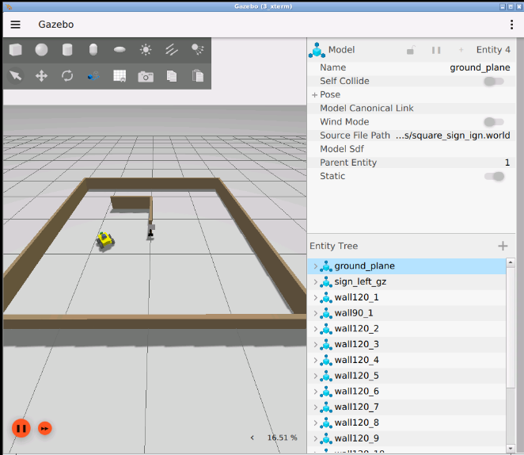
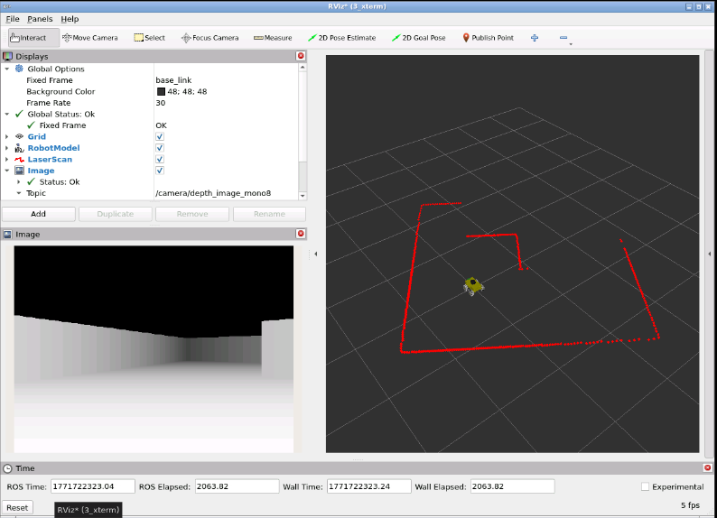
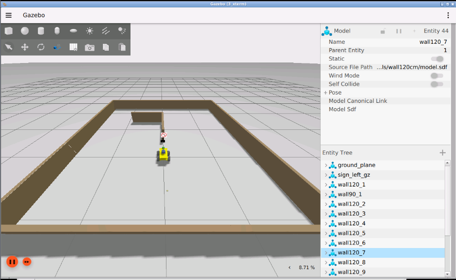
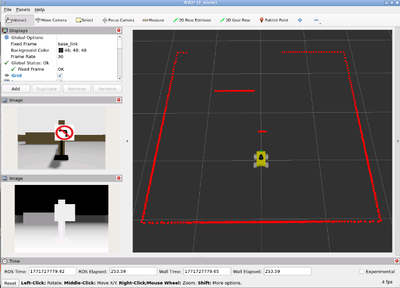

# GZ sim

Models on `my_robot_bringup/Models`

Launch:
````bash
ros2 launch my_robot_bringup my_robot_bringup_gz.launch.py world:=square_sign_ign.world robot:=rubot_mecanum x:=0.0 y:=0.0 w:=90
````
In .bashrc add:
````bash
export GZ_SIM_RESOURCE_PATH=$(ros2 pkg prefix my_robot_bringup)/share/my_robot_bringup/models:${GZ_SIM_RESOURCE_PATH}
o
export IGN_GAZEBO_RESOURCE_PATH=/path/al/teu/models:$IGN_GAZEBO_RESOURCE_PATH
````

RGBA camera Test:
- Launch the robot bringup:
````bash
ros2 launch my_robot_bringup my_robot_bringup_gz.launch.py world:=square_sign_ign.world robot:=rubot_mecanum x:=0.0 y:=0.0 w:=90
````
- Move the robot on the world
````bash
ros2 run teleop_twist_keyboard teleop_twist_keyboard
````

- run a custopm node to visualize the depth in gray-scale with parametrized range scale:
````bash
cd src/AI_Projects/my_robot_ai_identification/my_robot_ai_identification/
python3 depth_to_mono8.py --ros-args -p min_m:=0.2 -p max_m:=3.0
````
- Open rviz2 and look at the generated topic `/camera/depth_image_mono8` to visualize the depth

This is only to obtain a proper visual gray-scale, but the real depth is obtained in the `/camera/depth_image` topic

You can move the robot to face the traffic sign:

